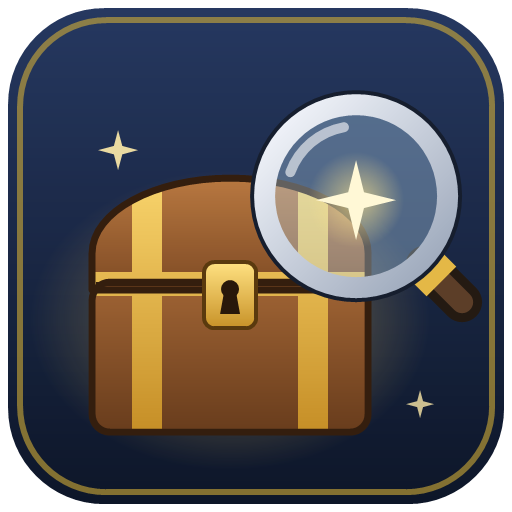

# LootFinderXIV



*English · [Français](README.fr.md)*

Dalamud plugin for FINAL FANTASY XIV that shows, for each duty, a **database-style loot sheet**:

1. **Rare rewards** (minions, mounts, orchestrion rolls): obtained or not, and where to find them.
2. **Tomestones and gil**: amount per boss, total, and the bonus when a player is new to the duty.
3. **Triple Triad cards**: obtained or not, and which boss drops them.
4. **One block per coffer**: each boss coffer, then each treasure coffer (with its map coordinates), with the
   equipment it contains, its drop chance or item level, and its status.
5. **Other items**: items dropped directly by bosses or found in the duty.

The sheet is a native, game-styled window (library [KamiToolKit](https://github.com/MidoriKami/KamiToolKit)).

## Installation

1. In game, open `/xlsettings` → **Experimental**.
2. Under **Custom Plugin Repositories**, add the URL below, tick **Enabled**, then click **Save**:
   ```
   https://raw.githubusercontent.com/Arzhaell/LootFinderXIV/main/repo.json
   ```
3. Open `/xlplugins`, search for **LootFinderXIV** and install it. Updates are then installed by Dalamud.

## Usage

- **All duties**: **`/lootfinder`** (or `/lfind`, or the plugin's button in Dalamud) lists every dungeon, trial,
  raid… grouped by type, with the number of rare rewards obtained (**x/x**). Click a duty to open its loot sheet.
  "Hide completed" keeps only the duties with rare rewards left.
- **Duty Finder / Raid Finder**: the sheet opens next to it, follows the selected duty, and closes with it
  (can be turned off).
- **During a duty**: **"Loot 1/2"** in the server info bar (top right): left click for the sheet, right click for
  the list of all duties.
- **`/lootfinder sheet`**: open / close the sheet of the selected or current duty. **`/lootfinder config`**: settings.

The interface is in English or French, following the language set in Dalamud's settings.

In the sheet: hover an icon for the game's item tooltip; right-click an item to link it in chat, try it on, or
force its "obtained" status. Tick "Hide obtained" to keep only what you still need.

## How "obtained" is determined

- **Minions, mounts, orchestrion rolls, cards…**: the game's unlock state, always accurate.
- **Equipment and other items**: the game keeps no history. LootFinderXIV remembers, per character, the items seen
  in your inventory, armoury chest, equipped gear, saddlebags, glamour dresser and armoire (the last two once
  opened). An item sold before installing the plugin can't be detected: right-click to mark it.

## Building

Requirements: .NET 10 SDK and XIVLauncher/Dalamud (the Dalamud SDK finds its assemblies in
`%APPDATA%\XIVLauncher\addon\Hooks\dev`).

KamiToolKit is a Git submodule (pinned to commit `6b7b191`): clone with `--recursive`, or fetch it afterwards.

```bash
git submodule update --init
```

```bash
dotnet build -c Release
```

If a Dalamud update breaks the KamiToolKit build, move the submodule to a newer version
(`git -C KamiToolKit pull origin main`) and commit the new submodule commit.

Dev plugin: `LootFinderXIV\bin\Release\LootFinderXIV.dll`.

## Data and licenses

- Coffers and drop chances: [LuminaSupplemental](https://github.com/Critical-Impact/LuminaSupplemental)
  (community data, GPL-3.0).
- Tomestones, gil, names, icons, unlocks: game files (`InstanceContent`, `TomestonesItem` sheets...).
- KamiToolKit: MIT.

LootFinderXIV is released under the **GPL-3.0** license (see `LICENSE`), as required by LuminaSupplemental.
